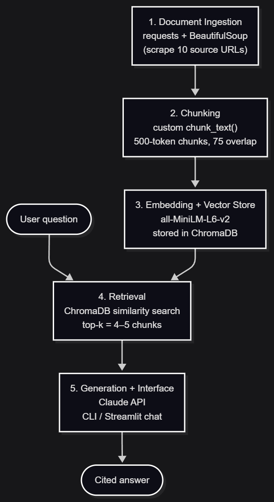

# Project 1 Planning: The Unofficial Guide

> Write this document before you write any pipeline code.
> Your spec and architecture diagram are what you'll use to direct AI tools (Claude, Copilot, etc.) to generate your implementation — the more specific they are, the more useful the generated code will be.
> Update the Retrieval Approach and Chunking Strategy sections if you change your approach during implementation.
> Update this file before starting any stretch features.

---

## Domain

<!-- What domain did you choose? Why is this knowledge valuable and hard to find through official channels? -->
I want to do off campus housing price. I picked the topic about the off campus houing for student, tips and trick to get along with roommate, how to pick a housing that also safe and easy to move around, and also about pricing too.
---

## Documents

<!-- List your specific sources: URLs, subreddit names, forum threads, or file descriptions.
     Aim for at least 10 sources that together cover different subtopics or perspectives within your domain. -->

| # | Source | Description | URL or location |
|---|--------|-------------|-----------------|
| 1 | | | |   Off-housing tips | https://findmyplace.co/blog/off-campus-student-housing-costs-breakdown/
| 2 | | | |   Housing price looking portal | https://www.collegerentals.com/off-campus-housing/mn/minneapolis/university-of-minnesota-twincities/?beds[]=1
| 3 | | | | tips and tricks | https://illustrarch.com/schooling/41550-complete-guide-to-student-housing-in-the-usa.html
| 4 | | | | tips and tricks for international student | https://www.universityliving.com/blog/accommodation/off-campus-accommodation-in-us-for-international-students/
| 5 | | | | tips and tricks base on choices | https://www.theblueground.com/blog/find-your-home/student-housing-top-usa-cities/
| 6 | | | | Accommodation for student in housing | https://eduvouchers.com/blogs/students-diary/student-accommodation-in-usa
| 7 | | | | safety tips | https://zolve.com/blog/how-to-find-safe-and-comfortable-student-housing-in-the-usa/
| 8 | | | | off housing with rm | https://outpost.me/blog/how-to-survive-in-a-student-community
| 9 | | | | more tips for sharing space in housing | https://blog.diggz.co/living-with-roommates-in-college-the-unofficial-requirement/
| 10 | | | | housing forum | https://www.reddit.com/r/uofmn/

---

## Chunking Strategy

<!-- How will you split documents into chunks?
     State your chunk size (in tokens or characters), overlap size, and explain why those
     numbers fit the structure of your documents.
     A review-heavy corpus warrants different chunking than a long FAQ. -->

**Chunk size:** 230 tokens *(revised down from 500 during implementation — see below)*

**Overlap:** 35 tokens *(~15%, revised from 75)*

**Reasoning:** My corpus is mostly long-form guide articles organized as discrete tips (pricing, safety, roommates), so I chunk paragraph-aware: whole paragraphs are packed together up to the token limit rather than cut mid-sentence, which keeps each tip intact and on a single topic. The ~15% overlap carries a sentence or two across chunk boundaries so a tip split mid-list doesn't lose context.

*Revision during implementation:* I originally specified 500-token chunks, but my embedding model, all-MiniLM-L6-v2, truncates any input longer than 256 tokens — so with 500-token chunks roughly the back half of every chunk would never be embedded, and retrieval would silently ignore it. I lowered chunk size to **230 tokens** (with ~35-token overlap) to stay safely under the 256-token limit, leaving headroom for the model's special tokens. Every token in every chunk now gets embedded, and the smaller chunks give tighter, more topically-focused retrieval. Token counts are measured with the all-MiniLM-L6-v2 tokenizer itself, so "tokens" here mean exactly what they mean at embedding time.

---

## Retrieval Approach

<!-- Which embedding model are you using (e.g., all-MiniLM-L6-v2 via sentence-transformers)?
     How many chunks will you retrieve per query (top-k)?
     If you were deploying this for real users and cost wasn't a constraint, what tradeoffs
     would you weigh in choosing a different embedding model — context length, multilingual
     support, accuracy on domain-specific text, latency? -->

**Embedding model:** all-MiniLM-L6-v2

**Top-k:** 4 or 5. enough to combine a couple of relevant tips (e.g. pricing + roommate advice) for broad questions without flooding the prompt with noise.

**Production tradeoff reflection:** If cost weren't a constraint I'd consider a larger model like OpenAI text-embedding-3-large for higher accuracy on domain-specific phrasing, or a multilingual model since one of my sources targets international students who may query in another language. The tradeoff is latency and dependence on a paid API versus MiniLM's instant, free local inference. For a small class corpus MiniLM's accuracy is sufficient; at real scale I'd weigh accuracy and multilingual support more heavily than speed.

---

## Evaluation Plan

<!-- List your 5 test questions with their expected correct answers.
     Questions should be specific enough that you can judge whether the system's response
     is right or wrong. "What are good dining halls?" is too vague.
     "What do students say about wait times at [dining hall name] during lunch?" is testable. -->

| # | Question | Expected answer |
|---|----------|-----------------|
| 1 | What is a realistic monthly rent range for off-campus student housing, and what costs beyond base rent should I budget for? | Rent varies widely by city/distance from campus; beyond base rent, budget for utilities, internet, a security deposit (often 1 month), application/broker fees, renter's insurance, and furnishing. (Sources 1, 2, 6) |
| 2 | What should an international student check before signing an off-campus lease in the US? | Verify the lease terms and length, whether a US-based guarantor/cosigner or extra deposit is required, proximity to campus/transit, what utilities are included, and the landlord's legitimacy. (Sources 4, 7) |
| 3 | What are concrete tips for getting along with roommates in shared student housing? | Set expectations early (a roommate agreement), split rent/bills fairly and in writing, agree on cleaning and quiet hours, communicate problems directly, and respect shared space and guests. (Sources 8, 9) |
| 4 | How can I tell whether an off-campus housing option is safe? | Check neighborhood crime data, look for working locks/secure entries/lighting, prefer locations near campus or reliable transit, read reviews of the landlord/building, and visit in person before committing. (Source 7) |
| 5 | What factors should I weigh when choosing the location of off-campus housing? | Balance distance/commute to campus, access to public transit, proximity to groceries and amenities, safety of the area, and how rent changes the closer you are to campus. (Sources 3, 5) |

---

## Anticipated Challenges

<!-- What could go wrong? Name at least two specific risks with reasoning.
     Consider: noisy or inconsistent documents, missing source attribution, off-topic
     retrieval, chunks that split key information across boundaries. -->

1. **Inconsistent, location-specific pricing.** My sources mix general nationwide advice with city-specific numbers (e.g. the Minneapolis rental portal). The system could retrieve a rent figure from one city and present it as if it applied everywhere. Mitigation: keep the source/city in each chunk's metadata and prompt the generator to cite the source and note that prices vary by location.

2. **Off-topic or boundary-split retrieval.** My guides bundle several subtopics (pricing, safety, roommates) in one article, so a broad question may pull chunks that are only loosely relevant, and a tip split across a chunk boundary may lose key detail. Mitigation: the 75-token overlap plus paragraph-aware chunking keeps tips intact, and retrieving top-k=4–5 gives enough coverage to surface the right chunk without flooding the prompt.

---

## Architecture

<!-- Draw a diagram of your pipeline showing the five stages:
     Document Ingestion → Chunking → Embedding + Vector Store → Retrieval → Generation
     Label each stage with the tool or library you're using.
     You can use ASCII art, a Mermaid diagram, or embed a sketch as an image.
     You'll use this diagram as context when prompting AI tools to implement each stage. -->

---

## AI Tool Plan

<!-- For each part of the pipeline below, describe:
     - Which AI tool you plan to use (Claude, Copilot, ChatGPT, etc.)
     - What you'll give it as input (which sections of this planning.md, which requirements)
     - What you expect it to produce
     - How you'll verify the output matches your spec

     "I'll use AI to help me code" is not a plan.
     "I'll give Claude my Chunking Strategy section and ask it to implement chunk_text()
     with my specified chunk size and overlap" is a plan. -->

**Milestone 3 — Ingestion and chunking:**

**Milestone 4 — Embedding and retrieval:**

**Milestone 5 — Generation and interface:**
